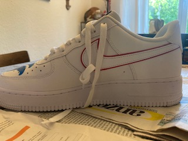

+++
title = "Bemalen eines Schuhes"
date = "2022-05-17"
draft = false
pinned = false
image = "thumbnail_img_2340.jpg"
description = "Es geht hier um das bemalen eines Schuhes. Der Schuh ist ein Air Force 1 Modell, welcher von Nike gefertigt wurde."
+++
* 

  ![Ich habe mich von vielen Künstlern auf Instagram inspirieren lassen. Ich kam schnell auf das Drachenmuster, da dieses sehr beliebt ist. Ich habe eine Schablone gefertigt und diese mit Farbe bemalen. Es ist wichtig, sorgfältig mit der Farbe umzugehen, da sie recht aggressiv ist. Wenig Farbe reicht schon um viel erreichen zu können. Bei der Schablone habe ich nur den Kopf des Drachens nachgezeichnet. Der Körper sowie die Beine wurden freihändig mit Bleistift vorgezeichnet. Das bemalen des Schuhs ist Zeitaufwändig. Lieber sorgfältig und langsam malen als Grob darüber.](thumbnail_img_2339.jpg)

  